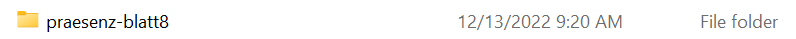

### Software
- PyCharm Professional (kostenlose Lizenz für Studierende) https://www.jetbrains.com/pycharm/download/#section=windows
- Python 3.11 https://www.python.org/downloads
  - Install Python on MacOS https://docs.python-guide.org/starting/install3/osx/

### Links
- Python Quick start: Siehe Notebook.
- Mehr zu Numpy https://numpy.org/doc/stable/user/quickstart.html
- Mehr zu Matplotlib https://matplotlib.org/stable/tutorials/introductory/quick_start.html
- Mehr zur virtuellen Umgebung https://docs.python.org/3/library/venv.html

### Einrichten
1. Projekt Ordner erstellen 


2. PyCharm Projekt erstellen und virtuelle Umgebung einrichten


3. Unter Windows ggfs. Terminal einstellen unter (File/Settings)


4. Kontrollieren ob virtuelle Umgebung richtig aufgesetzt wurde

Unter Linux / Mac
```
which python
```

Unter Windows
```
where python
```

Erwartet: `python` im `venv` Ordner wird (als erstes) angezeigt.


5. Dependencies installieren

```
pip install jupyterlab numpy matplotlib seaborn
```


6. Automatisiert testen

```
python test_bubblesort.py
```


7. Git diff vor dem Commit

