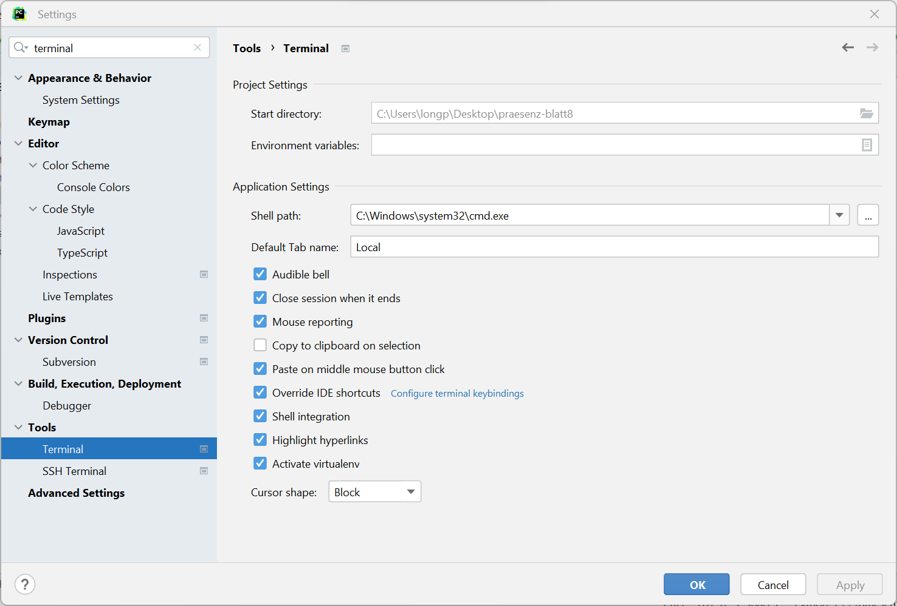
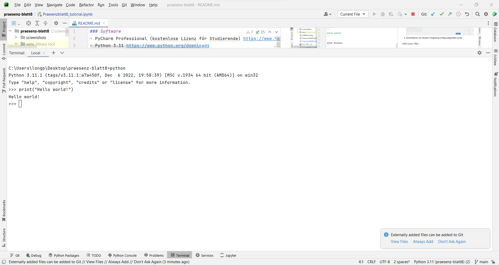
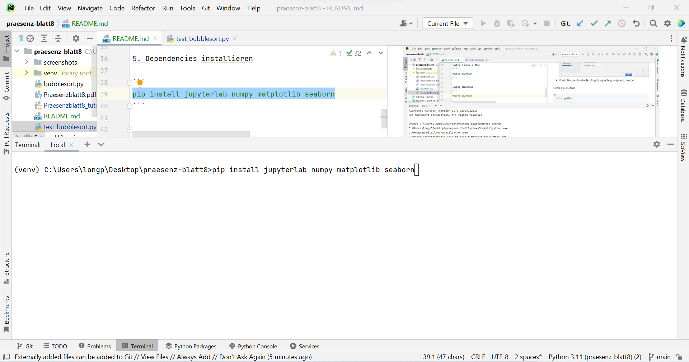
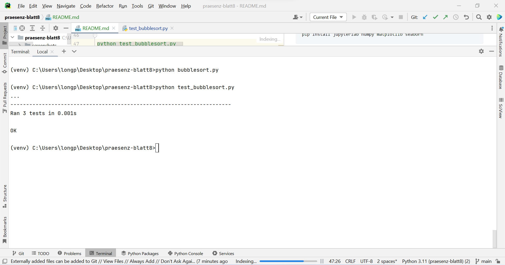
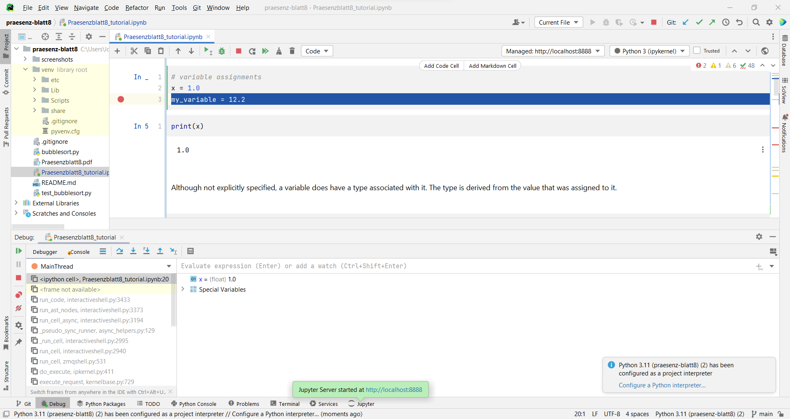

### Bonus gibt es für Abgaben, die:
- gut getestet sind (zuverlässige Testfälle, Randfälle testen, Test Dateien getrennt).
- Git als Version Control einsetzen (und nicht als Google Drive Alternative).
- gut dokumentiert sind (Dokumentationen sind gut, wenn sie mehr Information hergeben und einen Mehrwert haben).
- sonstige good practices umsetzen, wie:
  + Funktionen werden klein gehalten und jede Funktion realisiert nur eine Funktionalität.
  + sinnvolle Variablennamen.
  + etc.

### Software
- PyCharm Professional (kostenlose Lizenz für Studierende) https://www.jetbrains.com/pycharm/download/#section=windows
- Python 3.11 https://www.python.org/downloads
- Git https://git-scm.com/downloads

### Links
- Python Quick start: Siehe Notebook.
- Mehr zu Numpy https://numpy.org/doc/stable/user/quickstart.html
- Mehr zu Matplotlib https://matplotlib.org/stable/tutorials/introductory/quick_start.html
- (Advanced) Mehr zur virtuellen Umgebung https://docs.python.org/3/library/venv.html

### Einrichten
1. Projekt clonen 

```bash
git clone https://github.com/algotutorium/praesenz-blatt8.git
```

2. PyCharm Projekt erstellen und virtuelle Umgebung einrichten


3. (einmalig) Unter Windows ggfs. Terminal einstellen unter (File/Settings)


4. Zum Terminal gehen, kontrollieren ob virtuelle Umgebung richtig aufgesetzt wurde

Unter Linux / Mac
```
which python
```

Unter Windows
```
where python
```

Erwartet: `python` im `venv` Ordner wird (als erstes) angezeigt.


Interaktiven Interpreter verwenden und Python testen



5. Dependencies installieren
```
pip install jupyterlab numpy matplotlib seaborn
```


6. Automatisiert testen
```
python test_bubblesort.py
```


7. Git diff vor dem Commit


8. Debugger einsetzen

